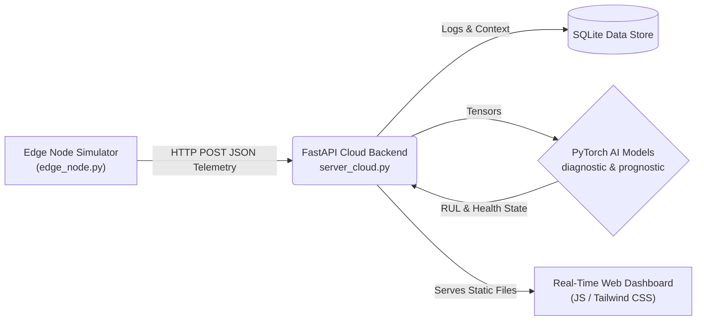

<div align="center">
  
  <h1>⚡ ChargeOps AI</h1>
  <p><b>An AI-Powered Wireless Power Transfer (WPT) Diagnostic & Prognostic Platform for Electric Vehicles</b></p>

[](https://python.org)
[](https://fastapi.tiangolo.com)
[](https://pytorch.org)
[](https://docker.com)
[](https://render.com)

</div>

<hr>

## 📖 Overview

**ChargeOps AI** is an advanced simulation and monitoring software suite designed for modern Wireless Power Transfer (WPT) EV charging infrastructure. It bridges the gap between raw hardware telemetry and high-level AI health monitoring.

The system features an autonomous edge node simulator that mimics the complex electronics of a wireless charging station (voltages, currents, temperatures, magnetic coupling). This data is pipelined into a cloud-based Python backend, where a built-in neural network estimates the **Remaining Useful Life (RUL)** and detects real-time physical breakdowns (e.g., resonance frequency drift out of the 80–90kHz range).

## ✨ Key Features

- **🔋 Continuous Edge Simulation**: Replicates real-world WPT electronics, generating live physics-based simulated data, including baseline noise and dynamically triggered breakdown scenarios.
- **🧠 Transformer AI Diagnostics**: Ingests live telemetry points to isolate normal states from critical hardware faults. Predicts component lifespan (RUL) in charging cycles.
- **🖥️ Live Dashboard Interface**: A beautiful, real-time frontend written with Tailwind CSS and Chart.js, visualizing vital physical metrics (I1/I2 margins, Q-factor, coil temperatures) and the AI's neural classifications.
- **🌐 Cloud Ready**: Easily deployable out of the box using Docker—or straight to cloud platforms like Render as a consolidated web service.
- **💻 Desktop Wrapper Mode**: Can run as a native desktop application window via PyWebView.

---

## 🏗️ Architecture



---

## 🚀 Quick Start (Local Development)

### 1. Prerequisites

- Python 3.10+
- Git

### 2. Installation

Clone the repository and install the dependencies. _Note: We use the CPU version of PyTorch by default to save storage and optimize cloud deployment._

```bash
git clone https://github.com/Houssemeddine-mag/ChargeOps-AI.git
cd ChargeOps-AI
pip install -r backend/requirements.txt --extra-index-url https://download.pytorch.org/whl/cpu
```

### 3. Run the Backend & Frontend Server

This spins up the FastAPI server, which hosts your endpoints and the dashboard UI.

```bash
cd backend
uvicorn server_cloud:app --host 127.0.0.1 --port 8000
```

_-> Go to `http://127.0.0.1:8000/` in your browser._

### 4. Run the Edge Simulator (The "Hardware")

In a separate terminal, launch the simulator. This script acts as your EV Charger, generating continuous telemetry data and beaming it into your local backend.

```bash
python backend/edge_node.py
```

### 5. (Alternative) Run as a Desktop App

You can use the desktop launcher to run the backend, frontend, and edge node wrapped inside a native OS window!

```bash
python run_desktop.py
```

---

## 🐳 Docker Deployment

The project includes a ready-to-run multi-process Docker environment.

```bash
# Build the Docker image
docker build -t chargeops-ai-app .

# Run the container
docker run -p 8000:8000 chargeops-ai-app
```

_The `docker-entrypoint.sh` script automatically handles starting both the API backend and the edge simulator loops._

---

## ☁️ Cloud Deployment on Render

This project is fully configured for a free-tier deployment on [Render](https://render.com).

1. Create a **New Web Service** connected to your repository.
2. Select **Python 3** as the environment.
3. Configure settings:
   - **Build Command:** `pip install -r backend/requirements.txt --extra-index-url https://download.pytorch.org/whl/cpu`
   - **Start Command:** `bash render-start.sh`
   - **Env Variables:** `PYTHON_VERSION = 3.10.12`

_(The `render-start.sh` explicitly fires up the Uvicorn cloud server and the Python edge simulator concurrently, making the deploy completely autonomous)._

---

## 📁 Repository Structure

```text
ChargeOps-AI/
├── backend/
│   ├── server_cloud.py     # FastAPI server & route handlers
│   ├── engine_node.py      # Transmits simulated data periodically to API
│   ├── sensor_simulator.py # Physics logic / Fault generation
│   ├── diagnostic.py       # AI limits & diagnostic rules (80-90khz limits)
│   ├── prognostic.py       # Predicts Remaining Useful Life (RUL)
│   ├── ai_transformer.py   # Core PyTorch neural network logic
│   └── requirements.txt    # Python dependencies
├── frontend/
│   ├── index.html          # Main Dashboard
│   ├── weights.html        # Transformer neural visualization view
│   └── js/                 # Dashboard logic (app.js, weights.js)
├── run_desktop.py          # Native desktop window wrapper (PyWebView)
├── render-start.sh         # Cloud unified startup script
├── Dockerfile              # Container definition
└── docker-entrypoint.sh    # Docker orchestration script
```

---

<p align="center">Made with ❤️ for the future of Electric Vehicles & Operations.</p>
